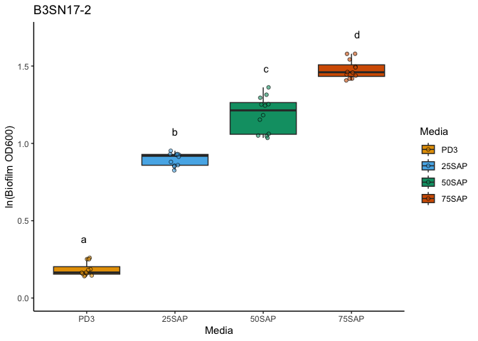
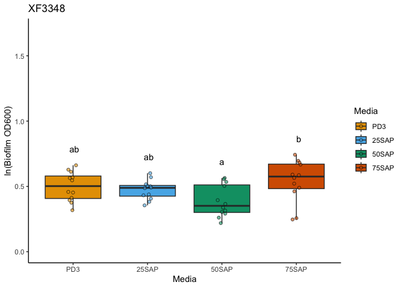
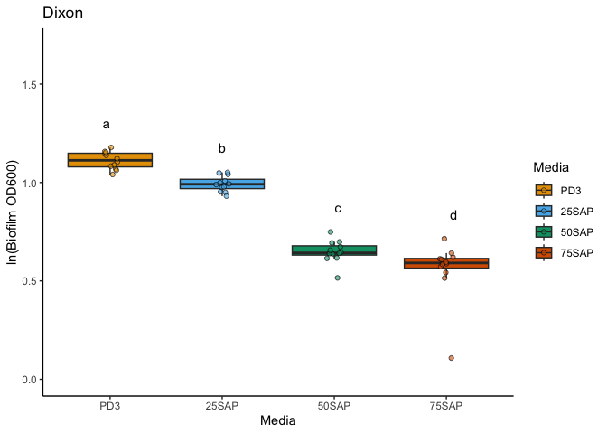
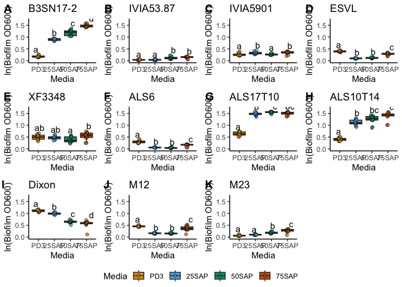
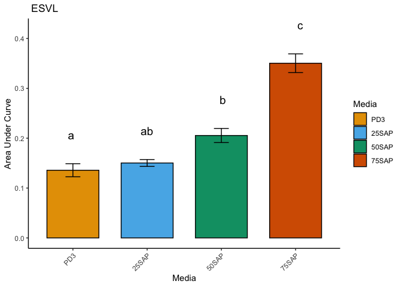
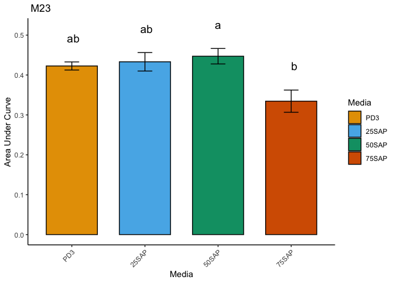

# Biofilm Data Analysis

## Data Manipulation

``` r
#Loading all necessary libraries
library(readxl)
library(tidyverse)
```

    ## ── Attaching core tidyverse packages ──────────────────────── tidyverse 2.0.0 ──
    ## ✔ dplyr     1.1.4     ✔ readr     2.1.5
    ## ✔ forcats   1.0.0     ✔ stringr   1.5.1
    ## ✔ ggplot2   3.5.1     ✔ tibble    3.2.1
    ## ✔ lubridate 1.9.3     ✔ tidyr     1.3.1
    ## ✔ purrr     1.0.2     
    ## ── Conflicts ────────────────────────────────────────── tidyverse_conflicts() ──
    ## ✖ dplyr::filter() masks stats::filter()
    ## ✖ dplyr::lag()    masks stats::lag()
    ## ℹ Use the conflicted package (<http://conflicted.r-lib.org/>) to force all conflicts to become errors

``` r
library(dplyr)
library(tidyr)
library(ggpubr)

# Reading excel files and sheets.
BiofilmFile <- "Data/RawData/Biofilm.xlsx"
sheet_names <- excel_sheets(BiofilmFile)

# Initializing list
combined_data <- list()

# Reading and processing each sheets
for (sheet in sheet_names) {
  data1 <- read_excel(BiofilmFile, sheet = sheet, range = "B24:N31") %>%
    slice(-1) %>%  # Removing row 25 (second row from all sheets because it doesnot include samples)
    mutate(Sheet = sheet)
  
  combined_data[[sheet]] <- data1
}
```

    ## New names:
    ## New names:
    ## New names:
    ## New names:
    ## New names:
    ## New names:
    ## New names:
    ## New names:
    ## • `` -> `...1`

``` r
# Combining all the sheets into a single data
data2 <- bind_rows(combined_data)

# Renaming the columns according to names of strains used in each columns
colnames(data2)[1:13] <- c("Media","Control", "B3SN17-2", "IVIA53.87", "IVIA5901", "ESVL", "XF3348", "ALS6", "ALS17T10", "ALS10T14", "Dixon", 
                                "M12", "M23")

# Renaming the media columns according to different media used in different plates (sheets).
data2$Media <- rep(c("PD3","25SAP", "50SAP", "75SAP"), each = 12)

# Subtracting control from each strain column
for (i in 3:13) {
  data2[, i] <- data2[, i] - data2[, 2]
}

# Removing the control column (column 2)
data3 <- data2[, -2]  

# Pivoting the data to long format
final_data <- data3 %>%
  pivot_longer(
    cols = -c(Media, Sheet),  
    names_to = "Strain",
    values_to = "Biofilm"
  )


final_data <- final_data %>%
  mutate(Rep = rep(c(1, 2), each = 66, length.out = n())) #Adding a column representing replication based on number of plates
final_data <- final_data[, -2] #Removing second column


#Saving the manipulated and organized file for further analysis
write.csv(final_data, "Data/CleanData/Biofilm.csv", row.names = FALSE)
```

## Data Analysis

``` r
# Loading necessary libraries
library(tidyverse)
library(ggpubr)
library(ggplot2)
library(nlme)
```

    ## 
    ## Attaching package: 'nlme'

    ## The following object is masked from 'package:dplyr':
    ## 
    ##     collapse

``` r
library(emmeans)
```

    ## Welcome to emmeans.
    ## Caution: You lose important information if you filter this package's results.
    ## See '? untidy'

``` r
library(multcomp)
```

    ## Loading required package: mvtnorm

    ## Loading required package: survival

    ## Loading required package: TH.data

    ## Loading required package: MASS

    ## 
    ## Attaching package: 'MASS'

    ## The following object is masked from 'package:dplyr':
    ## 
    ##     select

    ## 
    ## Attaching package: 'TH.data'

    ## The following object is masked from 'package:MASS':
    ## 
    ##     geyser

``` r
library(multcompView)


# Loading data and displaying first six rows.
Data_Biofilm <- read.csv("Data/CleanData/Biofilm.csv", na.strings = "na")
head(Data_Biofilm)
```

    ##   Media    Strain Biofilm Rep
    ## 1   PD3  B3SN17-2   0.157   1
    ## 2   PD3 IVIA53.87   0.043   1
    ## 3   PD3  IVIA5901   0.276   1
    ## 4   PD3      ESVL   0.425   1
    ## 5   PD3    XF3348   0.573   1
    ## 6   PD3      ALS6   0.385   1

``` r
# Setting categorical variables as factor.
Data_Biofilm$Media = as.factor(Data_Biofilm$Media)
Data_Biofilm$Strain = as.factor(Data_Biofilm$Strain)

# Loading color blind palette
cbbPalette <- c("#000000", "#E69F00", "#56B4E9", "#009E73", "#F0E442", "#0072B2", "#D55E00", "#CC79A7")

# Creating a vector to loop over all the strains
unique_strains <- unique(Data_Biofilm$Strain)

# Creating a list to store all the plots
plots <- list()

# Creating a loop through each strain for analysis
for (strain_name in unique_strains) {
  sub_data <- Data_Biofilm %>% filter(Strain == strain_name) #subsetting the data
  sub_data <- sub_data %>% mutate(logBiofilm = log(Biofilm + 1)) #adding a column with log transformation of the data
  cat("\n===== Analyzing Strain:", strain_name, "=====\n") #to display the name of strain while analyzing the data
  sub_data$Media <- relevel(sub_data$Media, ref = "PD3")  # Setting reference
  results <- lme(logBiofilm ~ Media, data = sub_data, random = ~1 | Rep) #fitting mixed effect model with Replication plate as random effect
  print(summary(results))
  print(intervals(results, which = "fixed"))
  sub_data$Media <- factor(sub_data$Media, levels = c("PD3", "25SAP", "50SAP", "75SAP")) #changing the order of the treatments
  lsmeans <- emmeans(results, ~Media) #estimate lsmeans of strain within media
  
  # Compact letter display
  results_lsmeans <- cld(lsmeans, alpha = 0.05, Letters = letters,  sort = FALSE)
  results_lsmeans_df <- as.data.frame(results_lsmeans)
  
  # Get y position for letter labels
  summary_df <- sub_data %>%
    group_by(Media) %>%
    summarise(y_max = max(logBiofilm) + 0.1)
  
  label_df <- merge(summary_df, results_lsmeans_df, by.x = "Media", by.y = "Media")
  
# Creating boxplots for each strain with media on x axis and logBiofilm values on y axis
  boxplot <- ggplot(data = sub_data, aes(x = Media, y = logBiofilm, fill = Media)) +  #defining aesthetics x as Media and y as logBiofilm
    geom_boxplot(position = position_dodge(), outlier.shape = NA) + #creating box plot without overlap and removing outliers
    geom_point(position = position_jitterdodge(dodge.width = 0.8), aes(fill=Media),alpha = 0.6, shape=21) + #filling the box plot with data points without overlap and setting transparency of the data points as 0.6 and shape to 21
    scale_fill_manual(values = c(cbbPalette[[2]], cbbPalette[[3]],cbbPalette[[4]], cbbPalette[[7]])) + #setting fills of boxplot and data points manually
    xlab("Media") + #labelling x axis
    ylab("ln(Biofilm OD600)") + #labelling y axis
    scale_y_continuous(limits = c(0,1.7)) +
    theme_classic()+ #setting theme classic to make plain white background
    ggtitle(paste(strain_name))+ #giving title to boxplot
    geom_text(data = label_df, aes(x = Media, y = y_max, label = .group), vjust = 0)
  
  plots[[strain_name]] <- boxplot
  
   # Displaying plots
  print(boxplot)
}
```

    ## 
    ## ===== Analyzing Strain: B3SN17-2 =====
    ## Linear mixed-effects model fit by REML
    ##   Data: sub_data 
    ##         AIC       BIC   logLik
    ##   -86.73617 -76.03104 49.36809
    ## 
    ## Random effects:
    ##  Formula: ~1 | Rep
    ##         (Intercept)   Residual
    ## StdDev:  0.02846273 0.06909002
    ## 
    ## Fixed effects:  logBiofilm ~ Media 
    ##                 Value  Std.Error DF  t-value p-value
    ## (Intercept) 0.1843994 0.02833460 43  6.50792       0
    ## Media25SAP  0.7138631 0.02820588 43 25.30902       0
    ## Media50SAP  1.0032091 0.02820588 43 35.56737       0
    ## Media75SAP  1.2934669 0.02820588 43 45.85805       0
    ##  Correlation: 
    ##            (Intr) M25SAP M50SAP
    ## Media25SAP -0.498              
    ## Media50SAP -0.498  0.500       
    ## Media75SAP -0.498  0.500  0.500
    ## 
    ## Standardized Within-Group Residuals:
    ##         Min          Q1         Med          Q3         Max 
    ## -2.46526126 -0.53130153 -0.05376473  0.68030117  2.26683096 
    ## 
    ## Number of Observations: 48
    ## Number of Groups: 2 
    ## Approximate 95% confidence intervals
    ## 
    ##  Fixed effects:
    ##                 lower      est.     upper
    ## (Intercept) 0.1272572 0.1843994 0.2415415
    ## Media25SAP  0.6569805 0.7138631 0.7707457
    ## Media50SAP  0.9463265 1.0032091 1.0600917
    ## Media75SAP  1.2365843 1.2934669 1.3503495

<!-- -->

    ## 
    ## ===== Analyzing Strain: IVIA53.87 =====
    ## Linear mixed-effects model fit by REML
    ##   Data: sub_data 
    ##         AIC       BIC   logLik
    ##   -154.6833 -143.9782 83.34167
    ## 
    ## Random effects:
    ##  Formula: ~1 | Rep
    ##         (Intercept)  Residual
    ## StdDev:  0.02012101 0.0316521
    ## 
    ## Fixed effects:  logBiofilm ~ Media 
    ##                  Value  Std.Error DF  t-value p-value
    ## (Intercept) 0.03869822 0.01690904 43 2.288612  0.0271
    ## Media25SAP  0.00292832 0.01292192 43 0.226616  0.8218
    ## Media50SAP  0.08281719 0.01292192 43 6.409048  0.0000
    ## Media75SAP  0.10471245 0.01292192 43 8.103477  0.0000
    ##  Correlation: 
    ##            (Intr) M25SAP M50SAP
    ## Media25SAP -0.382              
    ## Media50SAP -0.382  0.500       
    ## Media75SAP -0.382  0.500  0.500
    ## 
    ## Standardized Within-Group Residuals:
    ##         Min          Q1         Med          Q3         Max 
    ## -3.23735049 -0.27227936  0.01610598  0.36049909  3.03454885 
    ## 
    ## Number of Observations: 48
    ## Number of Groups: 2 
    ## Approximate 95% confidence intervals
    ## 
    ##  Fixed effects:
    ##                    lower        est.      upper
    ## (Intercept)  0.004597901 0.038698222 0.07279854
    ## Media25SAP  -0.023131212 0.002928316 0.02898784
    ## Media50SAP   0.056757660 0.082817188 0.10887672
    ## Media75SAP   0.078652921 0.104712449 0.13077198

<!-- -->

    ## 
    ## ===== Analyzing Strain: IVIA5901 =====
    ## Linear mixed-effects model fit by REML
    ##   Data: sub_data 
    ##         AIC       BIC   logLik
    ##   -113.2804 -102.5753 62.64021
    ## 
    ## Random effects:
    ##  Formula: ~1 | Rep
    ##         (Intercept)   Residual
    ## StdDev: 0.004190171 0.05196537
    ## 
    ## Fixed effects:  logBiofilm ~ Media 
    ##                  Value  Std.Error DF   t-value p-value
    ## (Intercept) 0.26532388 0.01529091 43 17.351735  0.0000
    ## Media25SAP  0.06561453 0.02121477 43  3.092870  0.0035
    ## Media50SAP  0.00459823 0.02121477 43  0.216747  0.8294
    ## Media75SAP  0.07149019 0.02121477 43  3.369831  0.0016
    ##  Correlation: 
    ##            (Intr) M25SAP M50SAP
    ## Media25SAP -0.694              
    ## Media50SAP -0.694  0.500       
    ## Media75SAP -0.694  0.500  0.500
    ## 
    ## Standardized Within-Group Residuals:
    ##         Min          Q1         Med          Q3         Max 
    ## -2.64973906 -0.56891295 -0.09592893  0.52878216  2.58904748 
    ## 
    ## Number of Observations: 48
    ## Number of Groups: 2 
    ## Approximate 95% confidence intervals
    ## 
    ##  Fixed effects:
    ##                   lower        est.     upper
    ## (Intercept)  0.23448681 0.265323881 0.2961609
    ## Media25SAP   0.02283087 0.065614534 0.1083982
    ## Media50SAP  -0.03818543 0.004598232 0.0473819
    ## Media75SAP   0.02870653 0.071490192 0.1142739

<!-- -->

    ## 
    ## ===== Analyzing Strain: ESVL =====
    ## Linear mixed-effects model fit by REML
    ##   Data: sub_data 
    ##         AIC       BIC   logLik
    ##   -163.6443 -152.9391 87.82214
    ## 
    ## Random effects:
    ##  Formula: ~1 | Rep
    ##         (Intercept)   Residual
    ## StdDev:  0.01288387 0.02878685
    ## 
    ## Fixed effects:  logBiofilm ~ Media 
    ##                  Value  Std.Error DF   t-value p-value
    ## (Intercept)  0.3984935 0.01233101 43  32.31636       0
    ## Media25SAP  -0.2993754 0.01175218 43 -25.47403       0
    ## Media50SAP  -0.2779317 0.01175218 43 -23.64938       0
    ## Media75SAP  -0.1138627 0.01175218 43  -9.68864       0
    ##  Correlation: 
    ##            (Intr) M25SAP M50SAP
    ## Media25SAP -0.477              
    ## Media50SAP -0.477  0.500       
    ## Media75SAP -0.477  0.500  0.500
    ## 
    ## Standardized Within-Group Residuals:
    ##          Min           Q1          Med           Q3          Max 
    ## -3.295047892 -0.360270413 -0.001036088  0.554906896  2.114543687 
    ## 
    ## Number of Observations: 48
    ## Number of Groups: 2 
    ## Approximate 95% confidence intervals
    ## 
    ##  Fixed effects:
    ##                  lower       est.       upper
    ## (Intercept)  0.3736256  0.3984935  0.42336133
    ## Media25SAP  -0.3230759 -0.2993754 -0.27567485
    ## Media50SAP  -0.3016323 -0.2779317 -0.25423122
    ## Media75SAP  -0.1375632 -0.1138627 -0.09016214

<!-- -->

    ## 
    ## ===== Analyzing Strain: XF3348 =====
    ## Linear mixed-effects model fit by REML
    ##   Data: sub_data 
    ##         AIC       BIC   logLik
    ##   -43.91158 -33.20645 27.95579
    ## 
    ## Random effects:
    ##  Formula: ~1 | Rep
    ##         (Intercept)  Residual
    ## StdDev:  0.06238557 0.1117445
    ## 
    ## Fixed effects:  logBiofilm ~ Media 
    ##                  Value  Std.Error DF   t-value p-value
    ## (Intercept)  0.4992416 0.05464932 43  9.135367  0.0000
    ## Media25SAP  -0.0255990 0.04561949 43 -0.561141  0.5776
    ## Media50SAP  -0.1121791 0.04561949 43 -2.459017  0.0180
    ## Media75SAP   0.0428393 0.04561949 43  0.939058  0.3529
    ##  Correlation: 
    ##            (Intr) M25SAP M50SAP
    ## Media25SAP -0.417              
    ## Media50SAP -0.417  0.500       
    ## Media75SAP -0.417  0.500  0.500
    ## 
    ## Standardized Within-Group Residuals:
    ##         Min          Q1         Med          Q3         Max 
    ## -2.92226264 -0.38299841  0.05260412  0.69178913  1.74499832 
    ## 
    ## Number of Observations: 48
    ## Number of Groups: 2 
    ## Approximate 95% confidence intervals
    ## 
    ##  Fixed effects:
    ##                   lower        est.       upper
    ## (Intercept)  0.38903076  0.49924163  0.60945249
    ## Media25SAP  -0.11759943 -0.02559896  0.06640151
    ## Media50SAP  -0.20417959 -0.11217912 -0.02017865
    ## Media75SAP  -0.04916113  0.04283934  0.13483981

<!-- -->

    ## 
    ## ===== Analyzing Strain: ALS6 =====
    ## Linear mixed-effects model fit by REML
    ##   Data: sub_data 
    ##         AIC       BIC   logLik
    ##   -139.4415 -128.7363 75.72073
    ## 
    ## Random effects:
    ##  Formula: ~1 | Rep
    ##          (Intercept)   Residual
    ## StdDev: 1.741197e-06 0.03866523
    ## 
    ## Fixed effects:  logBiofilm ~ Media 
    ##                  Value  Std.Error DF    t-value p-value
    ## (Intercept)  0.3025161 0.01116169 43  27.103069       0
    ## Media25SAP  -0.2441547 0.01578501 43 -15.467500       0
    ## Media50SAP  -0.2573058 0.01578501 43 -16.300635       0
    ## Media75SAP  -0.1429321 0.01578501 43  -9.054922       0
    ##  Correlation: 
    ##            (Intr) M25SAP M50SAP
    ## Media25SAP -0.707              
    ## Media50SAP -0.707  0.500       
    ## Media75SAP -0.707  0.500  0.500
    ## 
    ## Standardized Within-Group Residuals:
    ##         Min          Q1         Med          Q3         Max 
    ## -2.91477413 -0.31129379 -0.05360676  0.51693159  2.61079574 
    ## 
    ## Number of Observations: 48
    ## Number of Groups: 2 
    ## Approximate 95% confidence intervals
    ## 
    ##  Fixed effects:
    ##                  lower       est.      upper
    ## (Intercept)  0.2800064  0.3025161  0.3250258
    ## Media25SAP  -0.2759882 -0.2441547 -0.2123212
    ## Media50SAP  -0.2891393 -0.2573058 -0.2254723
    ## Media75SAP  -0.1747656 -0.1429321 -0.1110986

<!-- -->

    ## 
    ## ===== Analyzing Strain: ALS17T10 =====
    ## Linear mixed-effects model fit by REML
    ##   Data: sub_data 
    ##         AIC       BIC   logLik
    ##   -98.45176 -87.74662 55.22588
    ## 
    ## Random effects:
    ##  Formula: ~1 | Rep
    ##         (Intercept)   Residual
    ## StdDev:  0.02477814 0.06048412
    ## 
    ## Fixed effects:  logBiofilm ~ Media 
    ##                 Value  Std.Error DF  t-value p-value
    ## (Intercept) 0.6405212 0.02473538 43 25.89495       0
    ## Media25SAP  0.8327521 0.02469254 43 33.72485       0
    ## Media50SAP  0.9067596 0.02469254 43 36.72201       0
    ## Media75SAP  0.8596393 0.02469254 43 34.81373       0
    ##  Correlation: 
    ##            (Intr) M25SAP M50SAP
    ## Media25SAP -0.499              
    ## Media50SAP -0.499  0.500       
    ## Media75SAP -0.499  0.500  0.500
    ## 
    ## Standardized Within-Group Residuals:
    ##        Min         Q1        Med         Q3        Max 
    ## -2.1541508 -0.3227502  0.1005042  0.6787080  1.5295354 
    ## 
    ## Number of Observations: 48
    ## Number of Groups: 2 
    ## Approximate 95% confidence intervals
    ## 
    ##  Fixed effects:
    ##                 lower      est.     upper
    ## (Intercept) 0.5906376 0.6405212 0.6904049
    ## Media25SAP  0.7829548 0.8327521 0.8825493
    ## Media50SAP  0.8569623 0.9067596 0.9565568
    ## Media75SAP  0.8098420 0.8596393 0.9094365

<!-- -->

    ## 
    ## ===== Analyzing Strain: ALS10T14 =====
    ## Linear mixed-effects model fit by REML
    ##   Data: sub_data 
    ##         AIC       BIC   logLik
    ##   -23.06788 -12.36274 17.53394
    ## 
    ## Random effects:
    ##  Formula: ~1 | Rep
    ##          (Intercept) Residual
    ## StdDev: 7.227924e-07 0.145092
    ## 
    ## Fixed effects:  logBiofilm ~ Media 
    ##                 Value  Std.Error DF   t-value p-value
    ## (Intercept) 0.4091363 0.04188444 43  9.768216       0
    ## Media25SAP  0.7088708 0.05923355 43 11.967388       0
    ## Media50SAP  0.8372356 0.05923355 43 14.134483       0
    ## Media75SAP  0.9789201 0.05923355 43 16.526448       0
    ##  Correlation: 
    ##            (Intr) M25SAP M50SAP
    ## Media25SAP -0.707              
    ## Media50SAP -0.707  0.500       
    ## Media75SAP -0.707  0.500  0.500
    ## 
    ## Standardized Within-Group Residuals:
    ##        Min         Q1        Med         Q3        Max 
    ## -2.5920931 -0.2548798  0.1493646  0.6677695  1.3229269 
    ## 
    ## Number of Observations: 48
    ## Number of Groups: 2 
    ## Approximate 95% confidence intervals
    ## 
    ##  Fixed effects:
    ##                 lower      est.     upper
    ## (Intercept) 0.3246682 0.4091363 0.4936043
    ## Media25SAP  0.5894150 0.7088708 0.8283266
    ## Media50SAP  0.7177797 0.8372356 0.9566914
    ## Media75SAP  0.8594643 0.9789201 1.0983759

<!-- -->

    ## 
    ## ===== Analyzing Strain: Dixon =====
    ## Linear mixed-effects model fit by REML
    ##   Data: sub_data 
    ##         AIC       BIC  logLik
    ##   -72.99841 -62.29327 42.4992
    ## 
    ## Random effects:
    ##  Formula: ~1 | Rep
    ##         (Intercept)   Residual
    ## StdDev:   0.0391003 0.08051378
    ## 
    ## Fixed effects:  logBiofilm ~ Media 
    ##                  Value  Std.Error DF    t-value p-value
    ## (Intercept)  1.1117552 0.03611956 43  30.779867   0e+00
    ## Media25SAP  -0.1188104 0.03286961 43  -3.614596   8e-04
    ## Media50SAP  -0.4639781 0.03286961 43 -14.115717   0e+00
    ## Media75SAP  -0.5534669 0.03286961 43 -16.838256   0e+00
    ##  Correlation: 
    ##            (Intr) M25SAP M50SAP
    ## Media25SAP -0.455              
    ## Media50SAP -0.455  0.500       
    ## Media75SAP -0.455  0.500  0.500
    ## 
    ## Standardized Within-Group Residuals:
    ##        Min         Q1        Med         Q3        Max 
    ## -5.2766502 -0.2203479  0.1347590  0.3244706  1.6226158 
    ## 
    ## Number of Observations: 48
    ## Number of Groups: 2 
    ## Approximate 95% confidence intervals
    ## 
    ##  Fixed effects:
    ##                  lower       est.       upper
    ## (Intercept)  1.0389132  1.1117552  1.18459726
    ## Media25SAP  -0.1850983 -0.1188104 -0.05252249
    ## Media50SAP  -0.5302660 -0.4639781 -0.39769026
    ## Media75SAP  -0.6197548 -0.5534669 -0.48717905

<!-- -->

    ## 
    ## ===== Analyzing Strain: M12 =====
    ## Linear mixed-effects model fit by REML
    ##   Data: sub_data 
    ##         AIC       BIC   logLik
    ##   -107.3202 -96.61509 59.66012
    ## 
    ## Random effects:
    ##  Formula: ~1 | Rep
    ##         (Intercept)  Residual
    ## StdDev:  0.01549152 0.0550283
    ## 
    ## Fixed effects:  logBiofilm ~ Media 
    ##                  Value  Std.Error DF   t-value p-value
    ## (Intercept)  0.4551107 0.01929602 43  23.58572   0e+00
    ## Media25SAP  -0.2951976 0.02246521 43 -13.14021   0e+00
    ## Media50SAP  -0.3010783 0.02246521 43 -13.40198   0e+00
    ## Media75SAP  -0.0851515 0.02246521 43  -3.79037   5e-04
    ##  Correlation: 
    ##            (Intr) M25SAP M50SAP
    ## Media25SAP -0.582              
    ## Media50SAP -0.582  0.500       
    ## Media75SAP -0.582  0.500  0.500
    ## 
    ## Standardized Within-Group Residuals:
    ##         Min          Q1         Med          Q3         Max 
    ## -4.38922714 -0.31231179 -0.05709867  0.25498103  2.93063583 
    ## 
    ## Number of Observations: 48
    ## Number of Groups: 2 
    ## Approximate 95% confidence intervals
    ## 
    ##  Fixed effects:
    ##                  lower        est.       upper
    ## (Intercept)  0.4161965  0.45511066  0.49402480
    ## Media25SAP  -0.3405031 -0.29519765 -0.24989223
    ## Media50SAP  -0.3463837 -0.30107826 -0.25577285
    ## Media75SAP  -0.1304569 -0.08515145 -0.03984604

<!-- -->

    ## 
    ## ===== Analyzing Strain: M23 =====
    ## Linear mixed-effects model fit by REML
    ##   Data: sub_data 
    ##         AIC      BIC   logLik
    ##   -135.7241 -125.019 73.86207
    ## 
    ## Random effects:
    ##  Formula: ~1 | Rep
    ##          (Intercept)   Residual
    ## StdDev: 1.025175e-06 0.04033353
    ## 
    ## Fixed effects:  logBiofilm ~ Media 
    ##                  Value  Std.Error DF   t-value p-value
    ## (Intercept) 0.06119563 0.01164329 43  5.255872  0.0000
    ## Media25SAP  0.03942781 0.01646609 43  2.394484  0.0211
    ## Media50SAP  0.12453204 0.01646609 43  7.562937  0.0000
    ## Media75SAP  0.20659276 0.01646609 43 12.546555  0.0000
    ##  Correlation: 
    ##            (Intr) M25SAP M50SAP
    ## Media25SAP -0.707              
    ## Media50SAP -0.707  0.500       
    ## Media75SAP -0.707  0.500  0.500
    ## 
    ## Standardized Within-Group Residuals:
    ##          Min           Q1          Med           Q3          Max 
    ## -4.571054992 -0.280217205  0.009163961  0.213941688  1.808926841 
    ## 
    ## Number of Observations: 48
    ## Number of Groups: 2 
    ## Approximate 95% confidence intervals
    ## 
    ##  Fixed effects:
    ##                   lower       est.      upper
    ## (Intercept) 0.037714704 0.06119563 0.08467656
    ## Media25SAP  0.006220761 0.03942781 0.07263485
    ## Media50SAP  0.091324992 0.12453204 0.15773908
    ## Media75SAP  0.173385715 0.20659276 0.23979980

<!-- -->

``` r
# Combining all plots into one figure with a common legend
combined_biofilm_plot <- ggarrange(plotlist = plots, ncol = 4, nrow = 3, labels = "AUTO", common.legend = TRUE, legend = "bottom")

# Displaying the combined plot
print(combined_biofilm_plot)
```

<!-- -->

``` r
#Saving the final figure
ggsave("Figures/combined_biofilm_plot.png", plot = combined_biofilm_plot, width = 10, height = 8, dpi = 300)
```

# Growth Data Analysis

## Data Manipulation

``` r
library(readxl)
library(dplyr)
library(tidyr)
library(purrr)

# Listing all Day files
GrowthData <- list.files(path = "Data/RawData", pattern = "^Day[0-7]\\.xlsx$", full.names = TRUE)

# Making a list of the all days data
all_days_data <- list()

# Looping through each file
for (file_name in GrowthData) {
  day_label <- tools::file_path_sans_ext(file_name)
  sheet_names <- excel_sheets(file_name)
  
  combined_data <- list()
  
# Looping through each sheet in the file
  for (sheet in sheet_names) {
    Growth1 <- read_excel(file_name, sheet = sheet, range = "B24:N31") %>%
      slice(-1) %>%  # Remove second row (Excel row 25)
      mutate(Sheet = sheet)
    
    combined_data[[sheet]] <- Growth1
  }
  
  # Combining all sheets into a single data
  Growth2 <- bind_rows(combined_data)
  
  # Renaming the columns according to names of strains used in each columns
  colnames(Growth2)[1:13] <- c("Media", "Control", "B3SN17-2", "IVIA53.87", "IVIA5901", "ESVL", 
                                  "XF3348", "ALS6", "ALS17T10", "ALS10T14", "Dixon", "M12", "M23")
  
  # Renaming the media columns according to different media used in different plates (sheets).
  Growth2$Media <- rep(c("PD3","25SAP", "50SAP", "75SAP"), each = 12)
  
  # Subtracting control from each strain column
  for (i in 3:13) {
    Growth2[, i] <- Growth2[, i] - Growth2[, 2]
  }
  
  # Removing the control column (column 2)
  Growth3 <- Growth2[, -2]
  
  # Pivoting the data to long format
  final_data <- Growth3 %>%
    pivot_longer(
      cols = -c(Media, Sheet),
      names_to = "Strain",
      values_to = "OD600"
    )
  
  # Adding a column representing replication based on number of plates
  final_data <- final_data %>%
    mutate(Rep = rep(c(1, 2), each = 66, length.out = n()))
  
  # Adding Day column 
  final_data$Day <- day_label
  
  all_days_data[[day_label]] <- final_data
}
```

    ## New names:
    ## New names:
    ## New names:
    ## New names:
    ## New names:
    ## New names:
    ## New names:
    ## New names:
    ## New names:
    ## New names:
    ## New names:
    ## New names:
    ## New names:
    ## New names:
    ## New names:
    ## New names:
    ## New names:
    ## New names:
    ## New names:
    ## New names:
    ## New names:
    ## New names:
    ## New names:
    ## New names:
    ## New names:
    ## New names:
    ## New names:
    ## New names:
    ## New names:
    ## New names:
    ## New names:
    ## New names:
    ## New names:
    ## New names:
    ## New names:
    ## New names:
    ## New names:
    ## New names:
    ## New names:
    ## New names:
    ## New names:
    ## New names:
    ## New names:
    ## New names:
    ## New names:
    ## New names:
    ## New names:
    ## New names:
    ## New names:
    ## New names:
    ## New names:
    ## New names:
    ## New names:
    ## New names:
    ## New names:
    ## New names:
    ## New names:
    ## New names:
    ## New names:
    ## New names:
    ## New names:
    ## New names:
    ## New names:
    ## New names:
    ## • `` -> `...1`

``` r
# Combining all the data into one dataframe
all_data_combined <- bind_rows(all_days_data)

#Replacing negative values with zero 
all_data_combined$OD600[all_data_combined$OD600 < 0] <- 0

#Removing column 2
all_data_combined <- all_data_combined[ , -2]

#Saving the manipulated and organized file to CSV for further analysis.
write.csv(all_data_combined, "Data/CleanData/GrowthData.csv", row.names = FALSE)
```

## Growth Curves

``` r
#loading necessary libraries
library(tidyverse)
library(stringr)
library(ggpubr)
library(ggplot2)

#Reading data to R and displaying first six rows
datum = read.csv("Data/CleanData/GrowthData.csv", )
head(datum)
```

    ##   Media    Strain OD600 Rep               Day
    ## 1   PD3  B3SN17-2 0.003   1 Data/RawData/Day0
    ## 2   PD3 IVIA53.87 0.003   1 Data/RawData/Day0
    ## 3   PD3  IVIA5901 0.003   1 Data/RawData/Day0
    ## 4   PD3      ESVL 0.005   1 Data/RawData/Day0
    ## 5   PD3    XF3348 0.009   1 Data/RawData/Day0
    ## 6   PD3      ALS6 0.006   1 Data/RawData/Day0

``` r
#Setting categorical variables as factor and log transforming the optical density values.
GrowthData<- datum%>%
  mutate(
    Strain = factor(Strain),
    Media = factor(Media),
    Rep = factor(Rep),
    Day = as.numeric(str_replace(Day, "Data/RawData/Day", "")),  # Converts "Day0" → 0
    logOD = log(OD600 + 0.001)  # Log-transform while avoiding log(0)
  )

# Color palette
cbbPalette <- c("#000000", "#E69F00", "#56B4E9", "#009E73", "#F0E442", "#0072B2", "#D55E00", "#CC79A7")

# Setting desirable media colors.
media_colors <- c("PD3" = "#E69F00", 
                  "25SAP" = "#56B4E9", 
                  "50SAP" = "#009E73", 
                  "75SAP" = "#D55E00")


# Calculating summary stats
growth_summary <- GrowthData %>%
  group_by(Strain, Media, Day) %>%
  summarise(
    mean_logOD600 = mean(logOD, na.rm = TRUE),
    se_logOD600 = sd(logOD, na.rm = TRUE) / sqrt(n()),
    .groups = "drop"
  )

# Ensuring correct media order and strain order
growth_summary$Media <- factor(growth_summary$Media, levels = names(media_colors))
growth_summary$Strain <- factor(growth_summary$Strain, levels = c("B3SN17-2", "IVIA53.87", "IVIA5901", "ESVL", "XF3348", "ALS6", "ALS17T10", "ALS10T14", "Dixon", "M12", "M23"))

# Creating the faceted plot
growth_curve_log <- ggplot(growth_summary, aes(x = Day, y = mean_logOD600, color = Media, group = Media)) +
  geom_line(size = 1) +
  geom_errorbar(aes(ymin = mean_logOD600 - se_logOD600, ymax = mean_logOD600+ se_logOD600), 
                width = 0.2, size = 0.8) +
  scale_color_manual(values = media_colors) +
  facet_wrap(~ Strain, scales = "free_y") +
  labs(title = "Bacterial Growth Curves",
       x = "Days",
       y = "log(OD600 + 0.001)",
       color = "Media") +
  theme_classic() +
  theme(legend.position = "bottom")
```

    ## Warning: Using `size` aesthetic for lines was deprecated in ggplot2 3.4.0.
    ## ℹ Please use `linewidth` instead.
    ## This warning is displayed once every 8 hours.
    ## Call `lifecycle::last_lifecycle_warnings()` to see where this warning was
    ## generated.

``` r
# Printing the plot
print(growth_curve_log)
```

<!-- -->

``` r
#Saving the plot
ggsave("Figures/GrowthCurves.png", plot = growth_curve_log, width = 10, height = 8, dpi = 300)
```

## Area under GrowthCurve

``` r
# Loading required libraries
library(MESS)
library(dplyr)
library(tidyverse)
library(ggplot2)
library(stringr)
library(nlme)
library(emmeans)
library(multcomp)
library(multcompView)
library(ggpubr)

# Loading data in R
GrowthData <- read.csv("Data/CleanData/GrowthData.csv")

# Defining the desired order for strains and media
strain_order <- c("B3SN17-2", "IVIA53.87", "IVIA5901", "ESVL", "XF3348", "ALS6", "ALS17T10", "ALS10T14", "Dixon", "M12", "M23")


#Loading color blind palette
cbbPalette <- c("#000000", "#E69F00", "#56B4E9", "#009E73", "#F0E442", "#0072B2", "#D55E00", "#CC79A7")

#Assigning the colors for different media
media_colors <- c("PD3" = "#E69F00", 
                  "25SAP" = "#56B4E9", 
                  "50SAP" = "#009E73", 
                  "75SAP" = "#D55E00")

GrowthData <- GrowthData %>%
  mutate(
    Strain = factor(Strain, levels = strain_order),
    Media = factor(Media),
    Rep = factor(Rep),
    Day = as.numeric(str_replace(Day, "Data/RawData/Day", ""))
  )

GrowthData_avg <- GrowthData %>%
  group_by(Strain, Media, Rep, Day) %>%
  summarize(OD600 = mean(OD600), .groups = "drop")
AUCdata <- GrowthData_avg %>%
  group_by(Strain, Media, Rep) %>%
  summarize(AUC = auc(Day, OD600), .groups = "drop")


# Creating a vector to loop over all the strains
unique_strains <- unique(AUCdata$Strain)

# Creating a list to store all the plots
plots <- list()

# Loop through each strain
for (strain_name in unique_strains) {
  cat("\n===== Analyzing Strain:", strain_name, "=====\n")
  sub_data <- AUCdata %>%
    filter(Strain == strain_name) %>% #subsetting data for each strain to run in a loop
    mutate(Media = factor(Media, levels = c("PD3", "25SAP", "50SAP", "75SAP")))  #giving desired order of treatment (media)

  # Running mixed effect model with Replication plate as a random effect
  Result <- lme(AUC ~ Media, data = sub_data, random = ~1|Rep)
  print(summary(Result))
  
  # Estimated marginal means
  lsmeans <- emmeans(Result, ~Media)
  
  # Compact letter display
  results_lsmeans <- cld(lsmeans, alpha = 0.05, Letters = letters, sort = FALSE)
  results_lsmeans_df <- as.data.frame(results_lsmeans)
  
  # Calculating summary stats
  summary_df <- sub_data %>%
    group_by(Media) %>%
    summarize(
      mean_AUC = mean(AUC, na.rm = TRUE),
      sd_AUC = sd(AUC, na.rm = TRUE),
      .groups = "drop"
    )
  
  # Merging letters into summary
  label_df <- merge(summary_df, results_lsmeans_df, by = "Media")
  label_df$y_label <- label_df$mean_AUC + label_df$sd_AUC + 0.05  # position for letters
  
  # Making a Bar plot
  Barplot <- ggplot(label_df, aes(x = Media, y = mean_AUC, fill = Media)) +
    geom_bar(stat = "identity", color = "black", width = 0.7) +
    geom_errorbar(aes(ymin = mean_AUC - sd_AUC, ymax = mean_AUC + sd_AUC),
                  width = 0.2) +
    geom_text(aes(y = y_label, label = .group), vjust = 0, size = 5) +
    labs(title = paste("", strain_name),
         x = "Media", y = "Area Under Curve") +
    scale_fill_manual(values = media_colors) +
    theme_classic() +
    theme(axis.text.x = element_text(angle = 45, hjust = 1))
  
  # Saving plot to list
  plots[[strain_name]] <- Barplot
  
  # Displaying plots
  print(Barplot)
}
```

    ## 
    ## ===== Analyzing Strain: B3SN17-2 =====
    ## Linear mixed-effects model fit by REML
    ##   Data: sub_data 
    ##         AIC       BIC   logLik
    ##   -7.515418 -11.19765 9.757709
    ## 
    ## Random effects:
    ##  Formula: ~1 | Rep
    ##         (Intercept)   Residual
    ## StdDev:  0.01562037 0.01142268
    ## 
    ## Fixed effects:  AUC ~ Media 
    ##                  Value  Std.Error DF   t-value p-value
    ## (Intercept) 0.22375000 0.01368345  3 16.351874  0.0005
    ## Media25SAP  0.05962500 0.01142268  3  5.219878  0.0137
    ## Media50SAP  0.02783333 0.01142268  3  2.436672  0.0928
    ## Media75SAP  0.04275000 0.01142268  3  3.742554  0.0333
    ##  Correlation: 
    ##            (Intr) M25SAP M50SAP
    ## Media25SAP -0.417              
    ## Media50SAP -0.417  0.500       
    ## Media75SAP -0.417  0.500  0.500
    ## 
    ## Standardized Within-Group Residuals:
    ##        Min         Q1        Med         Q3        Max 
    ## -1.1564487 -0.3008127  0.0000000  0.3008127  1.1564487 
    ## 
    ## Number of Observations: 8
    ## Number of Groups: 2

<!-- -->

    ## 
    ## ===== Analyzing Strain: IVIA53.87 =====
    ## Linear mixed-effects model fit by REML
    ##   Data: sub_data 
    ##        AIC       BIC  logLik
    ##   -1.27226 -4.954494 6.63613
    ## 
    ## Random effects:
    ##  Formula: ~1 | Rep
    ##          (Intercept)   Residual
    ## StdDev: 9.393465e-07 0.03256411
    ## 
    ## Fixed effects:  AUC ~ Media 
    ##                  Value  Std.Error DF   t-value p-value
    ## (Intercept)  0.6501667 0.02302630  3 28.235829  0.0001
    ## Media25SAP  -0.1492500 0.03256411  3 -4.583267  0.0195
    ## Media50SAP  -0.1893333 0.03256411  3 -5.814173  0.0101
    ## Media75SAP  -0.1937917 0.03256411  3 -5.951082  0.0095
    ##  Correlation: 
    ##            (Intr) M25SAP M50SAP
    ## Media25SAP -0.707              
    ## Media50SAP -0.707  0.500       
    ## Media75SAP -0.707  0.500  0.500
    ## 
    ## Standardized Within-Group Residuals:
    ##        Min         Q1        Med         Q3        Max 
    ## -1.1579723 -0.5182086  0.0000000  0.5182086  1.1579723 
    ## 
    ## Number of Observations: 8
    ## Number of Groups: 2

<!-- -->

    ## 
    ## ===== Analyzing Strain: IVIA5901 =====
    ## Linear mixed-effects model fit by REML
    ##   Data: sub_data 
    ##         AIC      BIC   logLik
    ##   -12.28846 -15.9707 12.14423
    ## 
    ## Random effects:
    ##  Formula: ~1 | Rep
    ##         (Intercept)    Residual
    ## StdDev:  0.00860646 0.006289045
    ## 
    ## Fixed effects:  AUC ~ Media 
    ##                 Value   Std.Error DF  t-value p-value
    ## (Intercept) 0.2101250 0.007537349  3 27.87784   1e-04
    ## Media25SAP  0.1145417 0.006289045  3 18.21289   4e-04
    ## Media50SAP  0.1267500 0.006289045  3 20.15409   3e-04
    ## Media75SAP  0.1602083 0.006289045  3 25.47419   1e-04
    ##  Correlation: 
    ##            (Intr) M25SAP M50SAP
    ## Media25SAP -0.417              
    ## Media50SAP -0.417  0.500       
    ## Media75SAP -0.417  0.500  0.500
    ## 
    ## Standardized Within-Group Residuals:
    ##           Min            Q1           Med            Q3           Max 
    ## -9.130527e-01 -4.565264e-01  6.620030e-15  4.565264e-01  9.130527e-01 
    ## 
    ## Number of Observations: 8
    ## Number of Groups: 2

<!-- -->

    ## 
    ## ===== Analyzing Strain: ESVL =====
    ## Linear mixed-effects model fit by REML
    ##   Data: sub_data 
    ##        AIC       BIC   logLik
    ##   -8.08722 -11.76945 10.04361
    ## 
    ## Random effects:
    ##  Formula: ~1 | Rep
    ##          (Intercept)   Residual
    ## StdDev: 1.201717e-06 0.01389238
    ## 
    ## Fixed effects:  AUC ~ Media 
    ##                  Value   Std.Error DF   t-value p-value
    ## (Intercept) 0.13575000 0.009823397  3 13.819048  0.0008
    ## Media25SAP  0.01454167 0.013892381  3  1.046737  0.3721
    ## Media50SAP  0.06966667 0.013892381  3  5.014739  0.0153
    ## Media75SAP  0.21462500 0.013892381  3 15.449115  0.0006
    ##  Correlation: 
    ##            (Intr) M25SAP M50SAP
    ## Media25SAP -0.707              
    ## Media50SAP -0.707  0.500       
    ## Media75SAP -0.707  0.500  0.500
    ## 
    ## Standardized Within-Group Residuals:
    ##        Min         Q1        Med         Q3        Max 
    ## -0.9567594 -0.6793292  0.0000000  0.6793292  0.9567594 
    ## 
    ## Number of Observations: 8
    ## Number of Groups: 2

<!-- -->

    ## 
    ## ===== Analyzing Strain: XF3348 =====
    ## Linear mixed-effects model fit by REML
    ##   Data: sub_data 
    ##         AIC       BIC   logLik
    ##   -26.62025 -30.30248 19.31012
    ## 
    ## Random effects:
    ##  Formula: ~1 | Rep
    ##         (Intercept)     Residual
    ## StdDev:  0.00555809 0.0006812617
    ## 
    ## Fixed effects:  AUC ~ Media 
    ##                   Value   Std.Error DF   t-value p-value
    ## (Intercept)  0.19041667 0.003959576  3  48.09016       0
    ## Media25SAP  -0.06262500 0.000681262  3 -91.92503       0
    ## Media50SAP  -0.03820833 0.000681262  3 -56.08467       0
    ## Media75SAP   0.07833333 0.000681262  3 114.98274       0
    ##  Correlation: 
    ##            (Intr) M25SAP M50SAP
    ## Media25SAP -0.086              
    ## Media50SAP -0.086  0.500       
    ## Media75SAP -0.086  0.500  0.500
    ## 
    ## Standardized Within-Group Residuals:
    ##           Min            Q1           Med            Q3           Max 
    ## -8.652080e-01 -3.427224e-01 -6.111084e-14  3.427224e-01  8.652080e-01 
    ## 
    ## Number of Observations: 8
    ## Number of Groups: 2

<!-- -->

    ## 
    ## ===== Analyzing Strain: ALS6 =====
    ## Linear mixed-effects model fit by REML
    ##   Data: sub_data 
    ##         AIC       BIC   logLik
    ##   -12.76932 -16.45155 12.38466
    ## 
    ## Random effects:
    ##  Formula: ~1 | Rep
    ##         (Intercept)    Residual
    ## StdDev: 0.004304718 0.006877317
    ## 
    ## Fixed effects:  AUC ~ Media 
    ##                  Value   Std.Error DF  t-value p-value
    ## (Intercept) 0.05370833 0.005737076  3  9.36162  0.0026
    ## Media25SAP  0.07037500 0.006877317  3 10.23292  0.0020
    ## Media50SAP  0.16087500 0.006877317  3 23.39212  0.0002
    ## Media75SAP  0.26808333 0.006877317  3 38.98080  0.0000
    ##  Correlation: 
    ##            (Intr) M25SAP M50SAP
    ## Media25SAP -0.599              
    ## Media50SAP -0.599  0.500       
    ## Media75SAP -0.599  0.500  0.500
    ## 
    ## Standardized Within-Group Residuals:
    ##           Min            Q1           Med            Q3           Max 
    ## -1.168828e+00 -3.557034e-01 -4.024558e-15  3.557034e-01  1.168828e+00 
    ## 
    ## Number of Observations: 8
    ## Number of Groups: 2

<!-- -->

    ## 
    ## ===== Analyzing Strain: ALS17T10 =====
    ## Linear mixed-effects model fit by REML
    ##   Data: sub_data 
    ##         AIC       BIC   logLik
    ##   -14.14745 -17.82969 13.07373
    ## 
    ## Random effects:
    ##  Formula: ~1 | Rep
    ##          (Intercept)    Residual
    ## StdDev: 1.748278e-07 0.006513074
    ## 
    ## Fixed effects:  AUC ~ Media 
    ##                  Value   Std.Error DF   t-value p-value
    ## (Intercept)  0.3299583 0.004605439  3  71.64536  0.0000
    ## Media25SAP  -0.0781667 0.006513074  3 -12.00150  0.0012
    ## Media50SAP  -0.0812500 0.006513074  3 -12.47491  0.0011
    ## Media75SAP  -0.0364167 0.006513074  3  -5.59132  0.0113
    ##  Correlation: 
    ##            (Intr) M25SAP M50SAP
    ## Media25SAP -0.707              
    ## Media50SAP -0.707  0.500       
    ## Media75SAP -0.707  0.500  0.500
    ## 
    ## Standardized Within-Group Residuals:
    ##           Min            Q1           Med            Q3           Max 
    ## -9.532109e-01 -6.845206e-01  1.278144e-14  6.845206e-01  9.532109e-01 
    ## 
    ## Number of Observations: 8
    ## Number of Groups: 2

<!-- -->

    ## 
    ## ===== Analyzing Strain: ALS10T14 =====
    ## Linear mixed-effects model fit by REML
    ##   Data: sub_data 
    ##         AIC       BIC   logLik
    ##   -6.166611 -9.848845 9.083306
    ## 
    ## Random effects:
    ##  Formula: ~1 | Rep
    ##         (Intercept)   Residual
    ## StdDev: 4.84677e-07 0.01766202
    ## 
    ## Fixed effects:  AUC ~ Media 
    ##                  Value  Std.Error DF  t-value p-value
    ## (Intercept) 0.29925000 0.01248894  3 23.96121  0.0002
    ## Media25SAP  0.04920833 0.01766202  3  2.78611  0.0686
    ## Media50SAP  0.06420833 0.01766202  3  3.63539  0.0359
    ## Media75SAP  0.10262500 0.01766202  3  5.81049  0.0101
    ##  Correlation: 
    ##            (Intr) M25SAP M50SAP
    ## Media25SAP -0.707              
    ## Media50SAP -0.707  0.500       
    ## Media75SAP -0.707  0.500  0.500
    ## 
    ## Standardized Within-Group Residuals:
    ##           Min            Q1           Med            Q3           Max 
    ## -9.908265e-01 -5.968550e-01  7.854828e-15  5.968550e-01  9.908265e-01 
    ## 
    ## Number of Observations: 8
    ## Number of Groups: 2

<!-- -->

    ## 
    ## ===== Analyzing Strain: Dixon =====
    ## Linear mixed-effects model fit by REML
    ##   Data: sub_data 
    ##         AIC       BIC   logLik
    ##   -13.21105 -16.89328 12.60552
    ## 
    ## Random effects:
    ##  Formula: ~1 | Rep
    ##          (Intercept)    Residual
    ## StdDev: 1.931448e-07 0.007321842
    ## 
    ## Fixed effects:  AUC ~ Media 
    ##                  Value   Std.Error DF  t-value p-value
    ## (Intercept) 0.29170833 0.005177324  3 56.34345  0.0000
    ## Media25SAP  0.03154167 0.007321842  3  4.30789  0.0230
    ## Media50SAP  0.12433333 0.007321842  3 16.98115  0.0004
    ## Media75SAP  0.15179167 0.007321842  3 20.73135  0.0002
    ##  Correlation: 
    ##            (Intr) M25SAP M50SAP
    ## Media25SAP -0.707              
    ## Media50SAP -0.707  0.500       
    ## Media75SAP -0.707  0.500  0.500
    ## 
    ## Standardized Within-Group Residuals:
    ##       Min        Q1       Med        Q3       Max 
    ## -1.007260 -0.634517  0.000000  0.634517  1.007260 
    ## 
    ## Number of Observations: 8
    ## Number of Groups: 2

<!-- -->

    ## 
    ## ===== Analyzing Strain: M12 =====
    ## Linear mixed-effects model fit by REML
    ##   Data: sub_data 
    ##       AIC       BIC logLik
    ##   -11.462 -15.14423 11.731
    ## 
    ## Random effects:
    ##  Formula: ~1 | Rep
    ##          (Intercept)    Residual
    ## StdDev: 4.276194e-07 0.009111101
    ## 
    ## Fixed effects:  AUC ~ Media 
    ##                  Value   Std.Error DF   t-value p-value
    ## (Intercept) 0.12466667 0.006442521  3 19.350603  0.0003
    ## Media25SAP  0.02279167 0.009111101  3  2.501527  0.0876
    ## Media50SAP  0.09970833 0.009111101  3 10.943610  0.0016
    ## Media75SAP  0.15100000 0.009111101  3 16.573190  0.0005
    ##  Correlation: 
    ##            (Intr) M25SAP M50SAP
    ## Media25SAP -0.707              
    ## Media50SAP -0.707  0.500       
    ## Media75SAP -0.707  0.500  0.500
    ## 
    ## Standardized Within-Group Residuals:
    ##           Min            Q1           Med            Q3           Max 
    ## -1.385672e+00 -1.486282e-01 -6.092349e-15  1.486282e-01  1.385672e+00 
    ## 
    ## Number of Observations: 8
    ## Number of Groups: 2

<!-- -->

    ## 
    ## ===== Analyzing Strain: M23 =====
    ## Linear mixed-effects model fit by REML
    ##   Data: sub_data 
    ##         AIC       BIC   logLik
    ##   -4.719493 -8.401727 8.359747
    ## 
    ## Random effects:
    ##  Formula: ~1 | Rep
    ##          (Intercept)  Residual
    ## StdDev: 5.068027e-07 0.0211641
    ## 
    ## Fixed effects:  AUC ~ Media 
    ##                  Value  Std.Error DF   t-value p-value
    ## (Intercept)  0.4226667 0.01496528  3 28.243149  0.0001
    ## Media25SAP   0.0104583 0.02116410  3  0.494154  0.6551
    ## Media50SAP   0.0244583 0.02116410  3  1.155652  0.3315
    ## Media75SAP  -0.0882083 0.02116410  3 -4.167828  0.0251
    ##  Correlation: 
    ##            (Intr) M25SAP M50SAP
    ## Media25SAP -0.707              
    ## Media50SAP -0.707  0.500       
    ## Media75SAP -0.707  0.500  0.500
    ## 
    ## Standardized Within-Group Residuals:
    ##           Min            Q1           Med            Q3           Max 
    ## -9.312151e-01 -6.792161e-01 -1.332268e-15  6.792161e-01  9.312151e-01 
    ## 
    ## Number of Observations: 8
    ## Number of Groups: 2

<!-- -->

``` r
# Combining all plots into one figure with a common legend
combined_AUC_plot <- ggarrange(plotlist = plots, ncol = 4, nrow = 3, labels = "AUTO", common.legend = TRUE, legend = "bottom")

# Displaying the combined plot
print(combined_AUC_plot)
```

<!-- -->

``` r
#Saving the final figure
ggsave("Figures/combined_AUC_plot.png", plot = combined_AUC_plot, width = 10, height = 8, dpi = 300)
```
